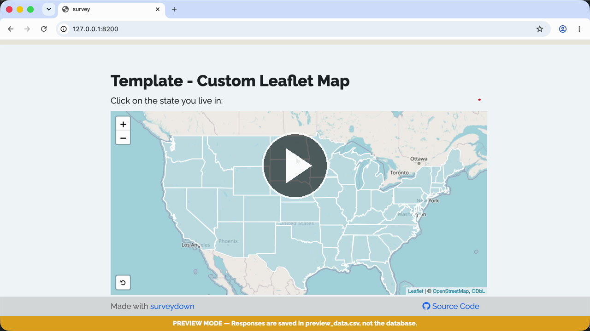

A template of a custom leaflet map question using `sd_question_custom()`.

### 🟢 Demo

Try the live survey: https://surveydown-custom-leaflet-map.hf.space

### 🎬 Walkthrough Recording

[](https://cdn.jsdelivr.net/gh/surveydown-dev/template_custom_leaflet_map@main/video-recording.mp4)

*Click the image above to play the recording.*

### Template page

https://surveydown.org/templates/custom_leaflet_map

### Create this template

Run this command in your R console:

```r
surveydown::sd_create_survey(
  #path = "path/to/survey",
  template = "custom_leaflet_map"
)
```

### Documentation

[Custom questions: leaflet map](https://surveydown.org/docs/custom-questions#leaflet-map-example) · [Start with a template](https://surveydown.org/docs/getting-started#start-with-a-template)
